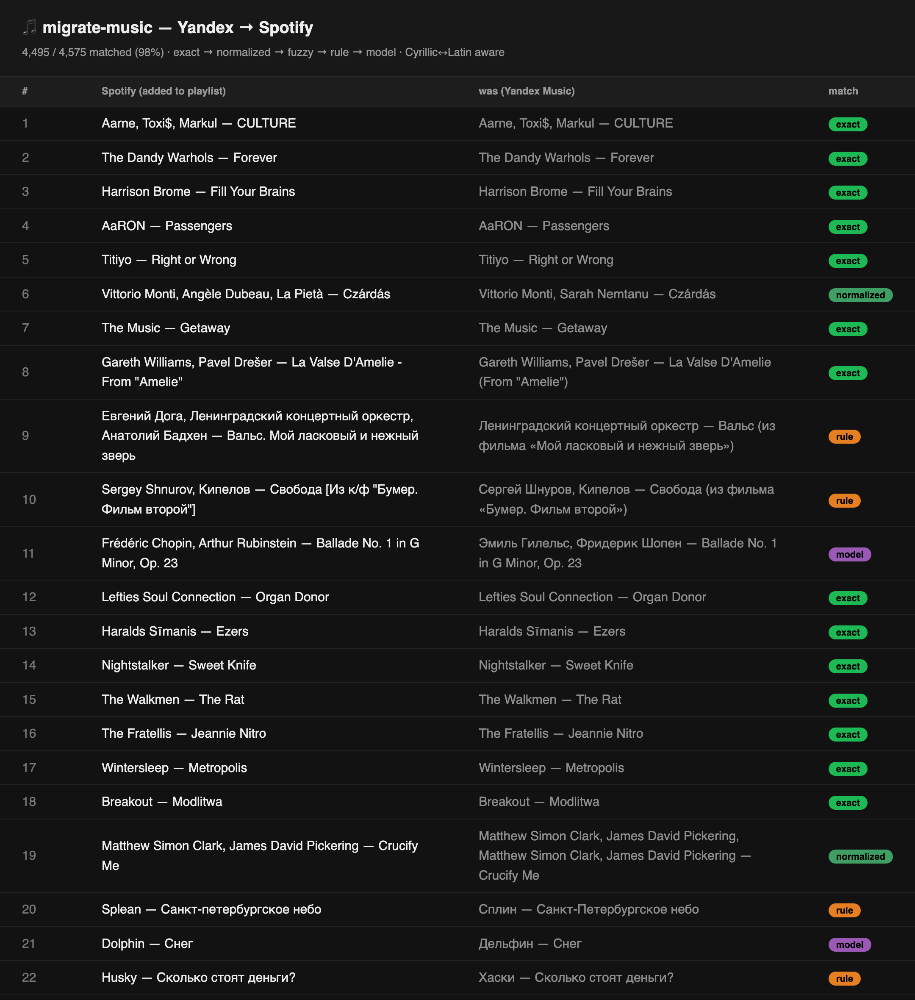

# 🎵 migrate-music

### Move your liked songs between Spotify, YouTube Music & Yandex — free, self-hosted, with smart cross-language matching.

**Supported (any direction):** 🟡 Yandex Music · 🟢 Spotify · 🔴 YouTube Music



> Every match is reviewable before anything is written. Cross-language matching
> handles Cyrillic↔Latin (`Сплин → Splean`, `Хаски → Husky`), `feat.`/remaster
> noise, and ambiguous cases via an optional small-model pass.

---

## How it works

```
 ┌──────────┐   ┌─────────┐   ┌────────────┐   ┌──────────┐
 │ 1. READ  │──▶│ 2. MATCH│──▶│ 3. VERIFY  │──▶│ 4. WRITE │
 │ liked    │   │ tiered  │   │ review the │   │ add to a │
 │ songs    │   │ matcher │   │ CSV        │   │ playlist │
 └──────────┘   └─────────┘   └────────────┘   └──────────┘
   source        title+artist   you approve      target
   (bulk)        normalize,      data/*.csv       playlist
                 translit, fuzzy
```

1. **Read** — bulk-pull all liked songs from the source service.
2. **Match** — find each on the target via a tiered matcher (exact → normalized → transliterated → fuzzy → optional Claude fallback). Handles Cyrillic↔Latin, `feat.`, remasters.
3. **Verify** — every match is written to a CSV with its tier + confidence for you to eyeball.
4. **Write** — add the approved matches to a playlist on the target.

---

## Install

```bash
git clone <repo-url> migrate-music && cd migrate-music
python3 -m venv .venv && .venv/bin/pip install -r requirements.txt
cp .env.example .env          # then fill in credentials for the services you use
```

Run a migration (dry run first, then `--commit`):

```bash
.venv/bin/python migrate.py sync --source yandex --target spotify --playlist "old music"
#   review data/sync_yandex_to_spotify.csv, then:
.venv/bin/python migrate.py sync --source yandex --target spotify --playlist "old music" --commit
```

---

## Service setup & requirements

<details>
<summary>🟡 <b>Yandex Music</b> — token + region requirement</summary>

**Requirement:** Yandex Music catalog is geo-locked. You need an IP in a **licensed region — Russia, Belarus, Kazakhstan** (or CIS). A VPN/proxy there is required for read/search/write (not for getting the token). Set `YANDEX_PROXY` in `.env` to route only Yandex calls, or just VPN your machine.

**Get a token** (one-time, valid ~1 year):
1. DevTools → Network → set throttling to **Slow 3G** (so the page doesn't redirect before you copy).
2. Open: `https://oauth.yandex.ru/authorize?response_type=token&client_id=23cabbbdc6cd418abb4b39c32c41195d`
3. After consent it lands on a URL containing `#access_token=…`. Copy the whole address-bar URL.
4. Put the token in `.env` → `YANDEX_MUSIC_TOKEN=`.

> Note: this is the official Yandex Music app client; the token is broad-scope — revoke it at id.yandex.ru/security when done if you like.
</details>

<details>
<summary>🟢 <b>Spotify</b> — free dev app + Premium</summary>

**Requirement:** **Spotify Premium** (since Feb 2026, Development-Mode apps require the owner to have Premium). The developer account itself is **free**.

**Set up:**
1. https://developer.spotify.com/dashboard → **Create app** (accept Developer Terms first).
2. Add Redirect URI exactly: `http://127.0.0.1:8888/callback`
3. Under **User Management**, add your account email.
4. Copy **Client ID** + **Client Secret** into `.env` (`SPOTIFY_CLIENT_ID` / `SPOTIFY_CLIENT_SECRET`).

First run opens a browser once to authorize; the token is cached and auto-refreshes.
</details>

<details>
<summary>🔴 <b>YouTube Music</b> — browser headers</summary>

**Requirement:** a YouTube Music account. No paid tier or cloud project needed for browser-header auth.

**Set up:**
1. Open `https://music.youtube.com` (logged in) → DevTools → Network → filter `/browse`.
2. Click a POST to `music.youtube.com` → copy its **request headers**.
3. Run `.venv/bin/python yt_auth.py`, paste the headers, press Ctrl-D. Creates `youtube_auth.json`.

> Browser auth expires on logout/cookie expiry — just re-run `yt_auth.py` to refresh.
</details>

---

## Migration guides

<details>
<summary>🟡➜🟢 <b>Yandex → Spotify</b></summary>

- **Requirements:** Yandex token + RU/BY/KZ VPN · Spotify app + Premium.
- **Command:** `migrate.py sync --source yandex --target spotify --playlist "old music" --commit`
- Slow step is searching Spotify — see [Speed](#speed--rate-limits). For very large libraries use the resumable background agent (below).
</details>

<details>
<summary>🟢➜🔴 <b>Spotify → YouTube Music</b></summary>

- **Requirements:** Spotify app + Premium · YouTube headers.
- **Command:** `migrate.py sync --source spotify --target youtube --playlist "from spotify" --commit`
- Fast: reading Spotify is cheap; searching YouTube is lenient.
</details>

<details>
<summary>🔴➜🟢 <b>YouTube Music → Spotify</b></summary>

- **Requirements:** YouTube headers · Spotify app + Premium.
- **Command:** `migrate.py sync --source youtube --target spotify --playlist "from yt" --commit`
- Slow step is searching Spotify — see [Speed](#speed--rate-limits).
</details>

<details>
<summary>🟡➜🔴 <b>Yandex → YouTube Music</b></summary>

- **Requirements:** Yandex token + RU/BY/KZ VPN · YouTube headers.
- **Command:** `migrate.py sync --source yandex --target youtube --playlist "from yandex" --commit`
- Fast on the YouTube side.
</details>

<details>
<summary>🟢➜🟡 / 🔴➜🟡 <b>… → Yandex</b></summary>

- **Requirements:** source creds · Yandex token + RU/BY/KZ VPN.
- **Command:** `migrate.py sync --source spotify --target yandex --playlist "imported" --commit`
- Yandex writes are best-effort (one request per track), so the write step is the slow part here.
</details>

---

## Speed & rate limits

Migration time is **dominated by the SEARCH step against the *target*** (one lookup per song). Read and write are cheap on Spotify/YouTube; Yandex writes are per-track.

**Per 1,000 songs, by stage:**

| Target | Read (source) | **Search (target)** | Write (target) |
|---|---|---|---|
| 🟢 Spotify | ~1 min | **bottleneck — see below** | ~1 min (100/req) |
| 🔴 YouTube | ~5 s | **~6–10 min** (~0.3–0.5 s/song) | ~5 s (batched) |
| 🟡 Yandex | ~1 min | **~5–6 min** (~0.3 s/song) | ~10+ min (1/req) |

**🟢 Spotify search is the hard one (Dev-Mode, post Feb-2026) — measured:**
- There's an **undocumented cumulative cap of ~650 requests per ~24 h**, then a
  **punitive ~13–24 h ban**. We confirmed it's **rate-independent**: one run banned
  at **~669** requests going fast (2–3/s), another at **~647** going slow (0.4/s,
  throttle verified) — *same count, different rates*. So **throttling does not help**;
  Spotify's docs only publish the rolling-30 s window and don't mention this cap.
- Net throughput: **~650 songs/day** when Spotify is the target. The background
  agent automates this — ~650/day, sleep out the ban, resume — e.g. **~4,500 songs
  ≈ 7 days**, fully unattended. (Our reference run: 4,575 Yandex likes → 4,495 matched.)
- Reads and the playlist write are cheap and **not** subject to this cap.

**🔴 YouTube / 🟡 Yandex search rates are estimates** based on the libraries (not yet
load-tested); they have no known punitive cap and should finish in minutes. Yandex
needs the regional VPN throughout. **Migrating *to* YouTube/Yandex avoids the Spotify
cap entirely** — only Spotify-as-target is slow.

> **Legend:** *measured* = observed on a real account; *estimated* = library-typical.

### Background agent (for slow/large or Spotify-target runs)

`auto_match.py` runs the match in throttled batches and **sleeps out any rate-limit ban** (using the real `Retry-After`) until done. Install it as a macOS LaunchAgent so it survives terminal-close, sleep, and reboot:

```bash
./agent.sh install     # start + auto-run on login
./agent.sh status      # progress
./agent.sh log         # live log
./agent.sh uninstall   # stop + remove
```

> The agent currently drives the dedicated Yandex→Spotify path (`migrate.py match`/`add`). The generic `sync` engine has the same resume + ban handling built in.

---

## Project layout

| File | Role |
|---|---|
| `migrate.py` | CLI: `sync` (generic) + `fetch`/`match`/`add` (Yandex→Spotify) |
| `engine.py` | Generic any→any migration (read → match → verify → write) |
| `services/` | `base.py` interface + `yandex.py` / `spotify.py` / `youtube.py` adapters |
| `matcher.py` · `normalize.py` | Tiered, language-aware matching |
| `llm.py` | Optional Claude fallback for leftovers |
| `auto_match.py` · `agent.sh` | Resumable background runner (macOS LaunchAgent) |

Outputs (liked-song dumps, match results, review CSVs) land in `data/` (git-ignored).

## Disclaimer

Personal-use tool, provided as-is under the [MIT License](LICENSE) — no warranty.

- **Not affiliated** with or endorsed by Yandex, Spotify, or Google/YouTube.
- Uses **unofficial** community libraries (`yandex-music`, `ytmusicapi`); these
  can break when a service changes its API.
- **You are responsible** for complying with each service's Terms of Service.
- Your OAuth tokens are powerful and stored **locally** (`.env`, `youtube_auth.json`).
  Never commit them (they're git-ignored); revoke them when you're done.
- Spotify Development Mode has a low daily request cap — see [Speed](#speed--rate-limits).

